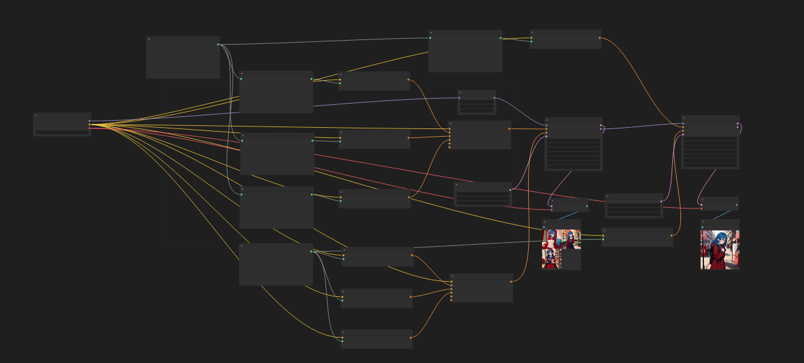

# comfyui-storydiffusion
This project is a comfyui implementation of storydiffusion. The structure of diffusers is not used in the project, so it will be fully compatible with all model structures of comfyui's unet. On the basis of the original sdxl, it also supports the use of sd1.5 and sd2.x, and of course lora clip_skip For these components, SeaArtApplyStory in the project will patch out some modules of the original comfyui. According to the implementation of the paper, only the attention module in the unet upsampling stage is affected. Since the id_length information will be cached in the attention module during the processing, currently we It will take up time and be saved in the cpu instead of cuda, so it is recommended that your id_length is not too large. Similarly, we provide SeaArtStoryKSampler and SeaArtStoryKSamplerAdvanced, which are essentially just simple encapsulation of comfyui's sampler. The returned model will retain the necessary cache information. Helps you continue to use it in the subsequent generation mode (write=false) of the story. In the process after write=false, the cache will not continue to increase. In theory, you can generate unlimited generation. Next, we will introduce what you need to pay attention to when using components.

SeaArtApplyStory is in the write=true stage, width height is the size of the image you generate, and id_length represents the total number of images that the attention layer needs to pay attention to, so the number of conditions, the number of latents, and id_length need to be unified.

SeaArtStoryKSampler SeaArtStoryKSamplerAdvanced is a simple encapsulation of comfyui's original comfyui, and returns the model structure of cache additional information.

SeaArtStoryInfKSampler After SeaArtStoryKSamplerInfAdvanced, the story will enter the write=false stage, and the cache will no longer increase. You can connect any sampler later to maintain the image.

SeaArtMergeStoryCondition is an additional component for organizing conditions. Due to the max of clip is 77, we will automatically identify conditions that are too long to complete all the conditions until the attention can be calculated. Of course, if the lengths are consistent, no additional deal with

SeaArtCharactorPrompt SeaArtAppendPrompt is just a simple concatenation of strings. You can of course use other ways to obtain strings.

If you want to use it with ella, you may need to modify the components appropriately, or leave us an issue by liking it. We will consider handling all issues in our spare time. It is compatible with various ecologies in comfyui. If you like this project, please give us a We like it, your encouragement is our motivation to update
(In addition, we believe that this method may also be applicable in dit, and we will consider supporting it for the upcoming sd3 after determining the effect)

In principle, this project can support most components in the comfyui ecosystem, but the adapter and others have not tested it.
This project does not include the processing of strings such as style prompts, nor the process of writing text on pictures.
## Workflow
We have specially prepared usage examples, including examples of using lora. In order to simplify the demonstration, our examples are simple and you do not need to install other plug-ins.

Finally, special thanks[StoryDiffusion](https://github.com/HVision-NKU/StoryDiffusion)